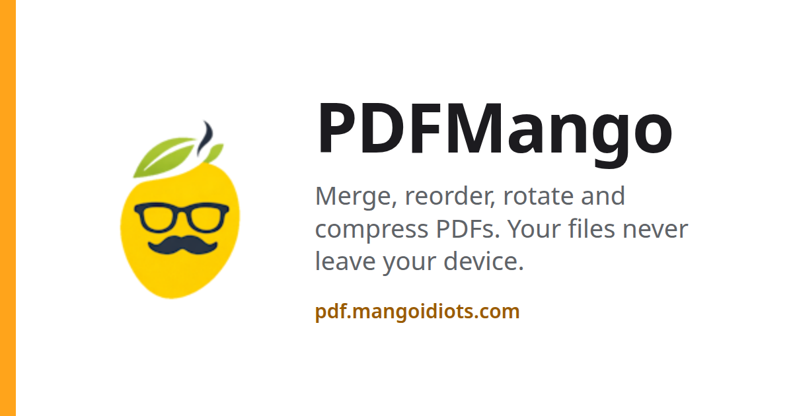
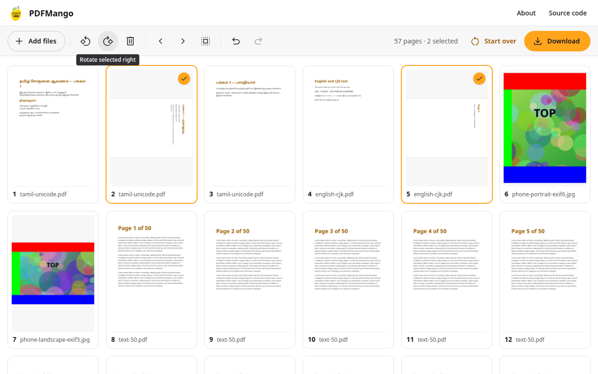
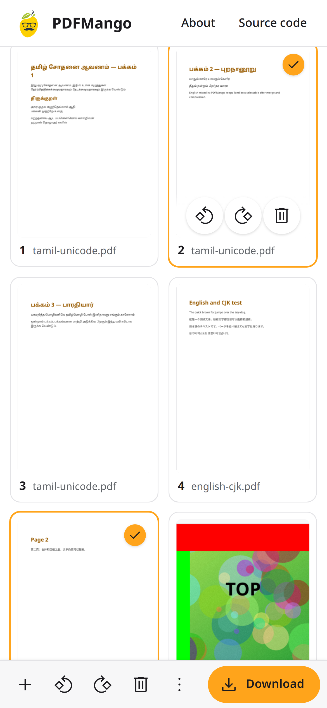
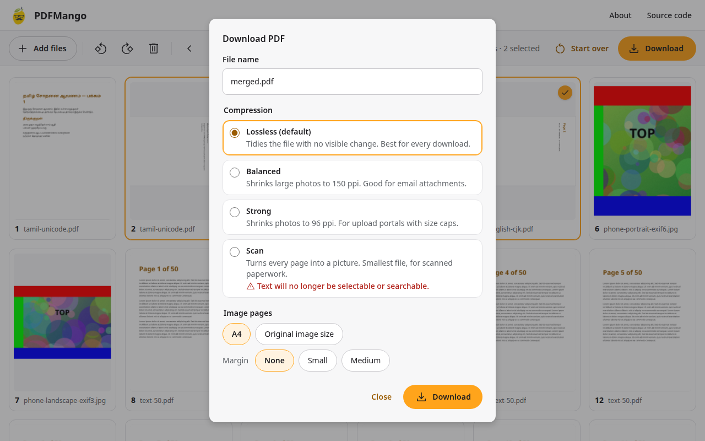
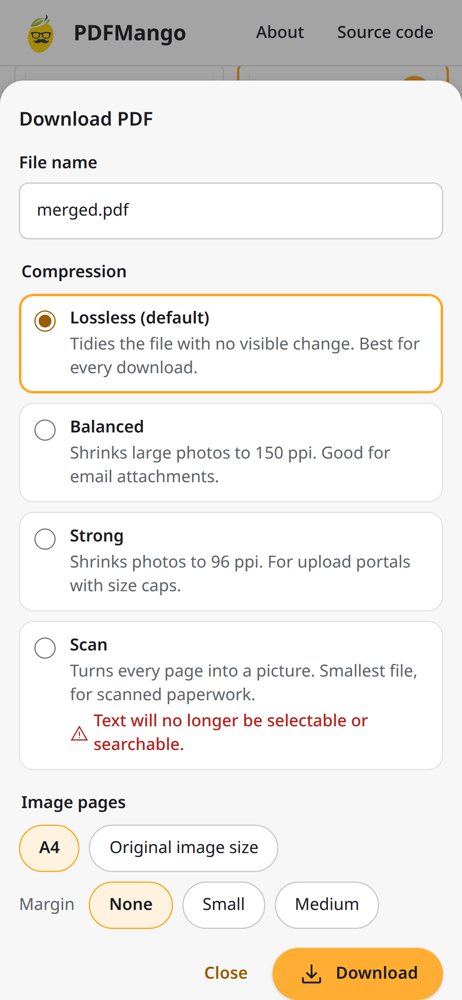

# PDFMango

A free, open-source PDF tool that runs entirely in your browser: merge, reorder, rotate and delete pages, turn photos into PDF pages, and compress the result. Files never leave your device.

Generated with Claude Opus 5.5. Use it at **https://pdf.mangoidiots.com**

## Why PDFMango

> I often need to do simple things with PDFs: put the pages in the right order, turn a page that is the wrong way round, join two documents, or make a large file small enough to send by email. Every time I looked for a tool for this, I ended up with something full of ads, cluttered with features I did not need, wanting me to upload my documents to someone else's server, or working on only one platform. I could not find one that I felt was reliable, safe, modern and simple, all at the same time.
>
> So I decided to have one built. PDFMango brings together well-established open-source PDF libraries, and I used Claude AI to design and develop it. Your files never leave your device; all the work happens inside your browser. There are no ads, no sign-ups and no clutter, and it works the same way on Windows, Mac, Linux, Android and iPhone.
>
> PDFMango is completely open source. The full source code is on GitHub, free for anyone to use, learn from, improve and benefit from.
>
> — Venkatarangan Thirumalai

## Features

- **Merge** any number of PDFs and JPG/PNG images into one PDF. Every page is tagged with the file it came from.
- **Reorder** by dragging (long-press then drag on touch screens), or from the keyboard with Alt+Arrow.
- **Rotate** in 90° steps and **delete** pages, one at a time or a whole selection (Shift+click selects a range).
- **Undo and redo** every edit (Ctrl/Cmd+Z, Shift+Ctrl/Cmd+Z).
- **Images to PDF:** each photo becomes a page, upright even when the phone stored it sideways. Pages are A4 by default (portrait or landscape to suit the photo) or the photo's own size, with an optional margin. JPEGs are embedded without re-encoding, and their hidden metadata (GPS location, camera serial numbers) is removed.
- **Compress** at four levels: **Lossless** (default; no visible change), **Balanced** (photos to 150 ppi), **Strong** (96 ppi) and **Scan** (every page becomes a picture; smallest file, but text is no longer selectable). PDFMango never hands you a file bigger than the Lossless one.
- **Unicode-safe:** Tamil, CJK and every other script stay selectable and searchable through every level except Scan.
- **Handles real-world files:** password-protected PDFs (you are asked for the password), damaged PDFs (repaired, with a notice), up to 1,000 pages and 250 MB on a computer (50 MB on phones).
- **Works offline** after the first visit, and installs as an app if you want it to.
- **Private by construction:** no upload, no server, no account, nothing stored.

## Screenshots

Made with the test fixtures in `tests/fixtures/` (never personal documents).

| Desktop | Phone |
| --- | --- |
|  |  |
|  |  |

## Privacy and analytics

PDFMango uses Google Analytics to count anonymous visits to the live site. Nothing about your files (their names, contents, pages or sizes) is ever collected or sent anywhere; your PDFs and images are processed entirely inside your browser. Analytics runs only on the live site (never while testing locally), waits until the app has fully loaded, and skips itself automatically if you are offline or your browser sends a Do Not Track or Global Privacy Control signal. Google sets its own first-party cookies to measure traffic; see [Google's privacy policy](https://policies.google.com/privacy) for details. PDFMango's full source is open on GitHub.

How this is enforced in the code:

- Files are read with the browser's File API and handed straight to a Web Worker; nothing is uploaded. The end-to-end tests assert that no request carries a body and that only same-origin requests happen on localhost.
- The app writes nothing to cookies, localStorage or IndexedDB. The service worker caches only the app's own files and has no runtime caching, so it never sees user files.
- Analytics events are limited to page views, `file_added {kind}`, `export {level}` and `error {code}` (`src/lib/analytics.ts`). The download link's click never reaches page-level listeners, so analytics can't see a file name.
- In the GA4 property, turn **off** Enhanced measurement → "File downloads" and "Outbound clicks". They aren't needed, and this keeps the guarantee independent of the code.

## How to use

1. Open https://pdf.mangoidiots.com and drop PDFs or JPG/PNG images on the page, or press **Choose files**.
2. Drag pages into order, or select a page and press Alt+← / Alt+→.
3. Select pages and use **Rotate** or **Delete**; with nothing selected, the toolbar acts on every page.
4. Press **Download**, check the file name and pick a compression level (and page size for photos).
5. The PDF downloads to your device. Change anything and download again whenever you like.

## Development

Requirements: Node.js 22 or later and npm. The end-to-end tests also need Playwright's Chromium (`npx playwright install chromium`).

```bash
npm ci             # install exact versions from package-lock.json
npm run dev        # dev server at http://localhost:5173
npm test           # Vitest: page model, helpers, image geometry, and the real engine against the fixtures
npm run check      # svelte-check (TypeScript + Svelte diagnostics)
npm run build      # production build into dist/
npx playwright test   # end-to-end tests against the production build (run npm run build first)
```

Other scripts:

| Script | What it does |
| --- | --- |
| `npm run fixtures` | Regenerates the test corpus in `tests/fixtures/` (Chromium prints the text PDFs, so fonts are embedded realistically) |
| `npm run fixtures:large` | Generates a ~250 MB PDF in `tests/fixtures/large/` for the desktop size limit (never committed) |
| `npm run brand` | Regenerates the favicon, PWA icons and social preview from `public/brand/mangoidiots-logo.png` |
| `npm run icons` | Regenerates `src/lib/icons.ts` (the Material Symbols subset the app uses) |
| `npm run screenshots` | Retakes the README screenshots from a production build |

The PDF engine is [MuPDF.js](https://mupdf.readthedocs.io/en/latest/reference/javascript/), pinned to an exact version (`mupdf` 1.28.1). Check every call against the docs for the installed version before upgrading; `SPIKE.md` records the places where 1.28.1 differs from older examples.

## GitHub Pages deployment and custom domain

Every push to `main` runs `.github/workflows/deploy.yml`: `npm ci` → `svelte-check` → `npm test` → `npm run build` → Playwright browser tests → `actions/upload-pages-artifact` → `actions/deploy-pages`. Generated site files are never committed.

One-time setup:

1. **Pages source:** in the repo, Settings → Pages → Build and deployment → Source: **GitHub Actions**.
2. **Custom domain file:** `public/CNAME` contains `pdf.mangoidiots.com` and is copied into every build.
3. **DNS:** wherever mangoidiots.com's DNS is managed, add one record:

   | Type | Host / Name | Value / Target |
   | --- | --- | --- |
   | CNAME | `pdf` | `venkatarangan.github.io` |

   Wait for it to resolve (`dig pdf.mangoidiots.com +short` should show `venkatarangan.github.io`).
4. **Custom domain in GitHub:** Settings → Pages → Custom domain: `pdf.mangoidiots.com` → Save. When GitHub has issued the certificate, tick **Enforce HTTPS**.
5. **Domain verification:** in your GitHub account (Settings → Pages → Add a domain), verify `mangoidiots.com` with the TXT record GitHub shows, so nobody else can claim the subdomain.
6. **WASM check:** on the live site, DevTools → Network: `mupdf-wasm-*.wasm` must be served as `application/wasm` (gzip-compressed). MuPDF falls back to an ArrayBuffer load if the type is wrong, so the app works either way, just a little slower to start.
7. **Smoke test after every deploy:** load the site, open a sample PDF, download it, open `/about/`, and check the console for Content-Security-Policy errors.

## Configuration

Everything tunable is in [`src/pdfmango.config.ts`](src/pdfmango.config.ts). Change it, rebuild, redeploy.

| Setting | Default | What it does |
| --- | --- | --- |
| `appName` | `PDFMango` | Product name |
| `siteUrl` | `https://pdf.mangoidiots.com` | Live address |
| `repoUrl` | `https://github.com/venkatarangan/pdfmango` | Source code link |
| `creditLine` | `Generated with Claude Opus 5.5` | Credit shown in the footer |
| `analytics.measurementId` | `G-XXXXXXXXXX` | GA4 measurement ID. Analytics stays off while this is the placeholder |
| `analytics.liveHostname` | `pdf.mangoidiots.com` | The only hostname on which analytics runs |
| `limits.mobileMaxMB` | `50` | Total size of all files in a session on phones, tablets and devices with ≤ 4 GB memory |
| `limits.desktopMaxMB` | `250` | Same, on computers |
| `limits.maxPages` | `1000` | Total pages across all files |
| `respectOwnerRestrictions` | `true` | `true`: PDFs whose author forbids page assembly are refused. `false`: they load, with a notice |
| `imagePages.defaultSize` | `A4` | Default page size for image pages (`A4` or `original`) |
| `imagePages.defaultMargin` | `none` | Default margin (`none`, `small`, `medium`) |
| `imagePages.marginsPt` | `0 / 18 / 36` | Margin sizes in points (18 pt ≈ 6 mm, 36 pt ≈ 13 mm) |
| `compression.balanced` | `150 ppi, q75, subset fonts` | Target resolution, JPEG quality and font subsetting for Balanced |
| `compression.strong` | `96 ppi, q55, subset fonts` | Same, for Strong |
| `compression.scan` | `110 ppi, q60` | Render resolution and JPEG quality for Scan |

The Content-Security-Policy lives in `vite.config.ts` and is added to built pages as a `<meta>` tag (GitHub Pages can't set headers).

## Project structure

| Path | Purpose |
| --- | --- |
| `index.html` | The app page: static app bar, footer and a copy of the empty state so the drop zone paints before any script runs |
| `about/index.html` | The About page (static) |
| `src/main.ts`, `src/App.svelte` | App entry and top-level layout: empty state, workspace, dialogs, drop target, shortcuts |
| `src/components/` | Svelte components: toolbar, page grid and cards, download, password, confirm and preview dialogs, snackbar |
| `src/lib/` | Main-thread logic: page model (undo/redo), app state, file sniffing, device limits, file names, compression options, thumbnail scheduler, engine client, analytics |
| `src/worker/` | The engine worker: MuPDF calls, export pipeline, image downsampling, Scan, JPEG/EXIF handling, image-page geometry |
| `src/pdfmango.config.ts` | All tunable values |
| `src/styles/` | Design tokens and shared styles |
| `public/` | Static files: logo, icons, social preview, `CNAME`, `.nojekyll`, `robots.txt` |
| `tests/unit/` | Vitest tests (including the real engine in Node) |
| `tests/e2e/` | Playwright end-to-end tests against the production build |
| `tests/fixtures/` | Test corpus (generated by `scripts/make-fixtures.mjs`) |
| `scripts/` | Generators for fixtures, brand assets, icons and screenshots |
| `spike/` | Milestone 1 throwaway spike; findings in `SPIKE.md` |
| `.github/workflows/deploy.yml` | CI: test, build, browser tests, deploy to Pages |

## Credits and licence

PDFMango is built on:

- [MuPDF.js](https://github.com/ArtifexSoftware/mupdf.js) by Artifex Software: the PDF engine (AGPL-3.0-or-later)
- [Svelte](https://svelte.dev/) and [Vite](https://vite.dev/) (MIT)
- [SortableJS](https://github.com/SortableJS/Sortable) (MIT)
- [Comlink](https://github.com/GoogleChromeLabs/comlink) (Apache-2.0)
- [vite-plugin-pwa](https://vite-pwa-org.netlify.app/) and [Workbox](https://developer.chrome.com/docs/workbox) (MIT)
- [Material Symbols](https://fonts.google.com/icons) (Apache-2.0)

Every dependency and its licence is listed in [THIRD_PARTY_NOTICES.md](THIRD_PARTY_NOTICES.md).

PDFMango is licensed under the **GNU Affero General Public License v3.0 or later** ([LICENSE](LICENSE)), as MuPDF.js requires. The "Source code" links in the app bar and footer offer the source to everyone who uses the app over a network, as the AGPL asks.

The mangoidiots name and logo are Venkatarangan Thirumalai's own branding and are not covered by the AGPL.
